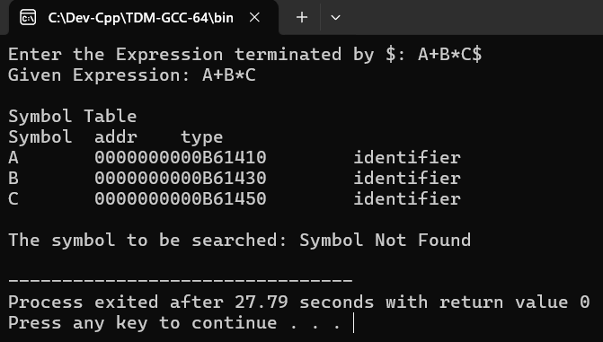

# Ex-1 IMPLEMENTATION-OF-SYMBOL-TABLE
# AIM :
## To write a C program to implement a symbol table.
# ALGORITHM
1.	Start the program.
2.	Get the input from the user with the terminating symbol ‘$’.
3.	Allocate memory for the variable by dynamic memory allocation function.
4.	If the next character of the symbol is an operator then only the memory is allocated.
5.	While reading, the input symbol is inserted into symbol table along with its memory address.
6.	The steps are repeated till ‘$’ is reached.
7.	To reach a variable, enter the variable to be searched and symbol table has been checked for corresponding variable, the variable along with its address is displayed as result.
8.	Stop the program. 
# PROGRAM
```c
#include <stdio.h>
#include <ctype.h>
#include <string.h>
#include <stdlib.h>

#define MAX_EXPRESSION_SIZE 100

int main() {
	int i = 0, j = 0, x = 0, n, flag = 0;
	void *add[5];
	char b[MAX_EXPRESSION_SIZE], d[15], c, srch;

	printf("Enter the Expression terminated by $: ");
	while ((c = getchar()) != '$' && i < MAX_EXPRESSION_SIZE - 1) {
		b[i++] = c;
	}
	b[i] = '\0'; // Null terminate the string
	n = i - 1;
	
	printf("Given Expression: %s\n", b);
	
	printf("\nSymbol Table\n");
	printf("Symbol\taddr\ttype\n");
	
	for (j = 0; j <= n; j++) {
		c = b[j];
		if (isalpha((unsigned char)c)) {
			if (j == n) {
				void *p = malloc(sizeof(char));
				add[x] = p;
				d[x] = c;
				printf("%c\t%p\tidentifier\n", c, p);
	} else {
		char ch = b[j + 1];
		if (ch == '+' || ch == '-' || ch == '*' || ch == '=') {
			void *p = malloc(sizeof(char));
			add[x] = p;
			d[x] = c;
			printf("%c\t%p\tidentifier\n", c, p);
			x++;
			}
		}
	}
	 
	}
	
	printf("\nThe symbol to be searched: ");
	srch = getchar();
	for (i = 0; i <= x; i++) {
		if (srch == d[i]) {
		printf("Symbol Found\n");
		printf("%c@address%p\n", srch, add[i]);
		flag = 1;
		}
	}
	
	if (flag == 0)
		printf("Symbol Not Found\n");
	
	// Free dynamically allocated memory
	for (i = 0; i <= x; i++) {
		free(add[i]);
	}

	return 0;
}
```
# OUTPUT

# RESULT
### The program to implement a symbol table is executed and the output is verified.
